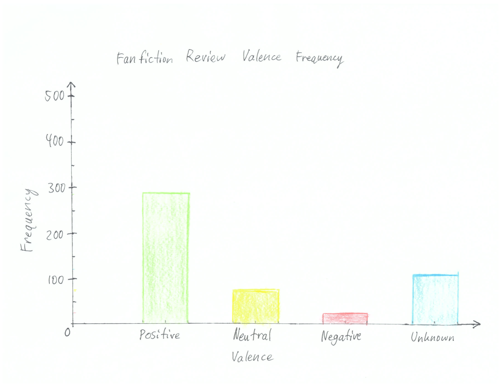

```{r setup, include=FALSE}
library(dplyr)
library(ggplot2)
library(stringr)

setwd("E:\\UW\\Autumn Quarter 2021\\HCDE 496\\fanfiction-data-visualization-1")
file <- paste(getwd(), "/data/fall_2020_-_batch_tewzr_allen_zhou.csv", sep="")

data <- read.csv(file)
```

prep

```{r, echo=TRUE}
positive <- filter(data, Valence=="Positive")
nrow(positive)
neutral <- filter(data, Valence=="Neutral")
nrow(neutral)
negative <- filter(data, Valence=="Negative")
nrow(negative)
unknown <- filter(data, Valence=="Unknown")
nrow(unknown)
```


hand written version



code version 1

```{r, echo=TRUE}
review_text <- select(data, Text) %>%
  mutate(word_count = str_count(Text, '\\w+'))

word_chart <- ggplot(review_text, aes(x=word_count)) +
  geom_histogram(binwidth=1, fill="black") +
  xlim(0, 600) +
  ylim(0, 25) +
  labs(title = "Fanfiction Review Word Counts by Frequency")
update_labels(word_chart, list(x = "Word Count", y = "Frequency"))
```

code version 2

Positive

```{r, echo=TRUE}
review_text_positive <- positive %>%
  mutate(word_count = str_count(Text, '\\w+'))

word_chart_positive <- ggplot(review_text_positive, aes(x=word_count)) +
  geom_histogram(binwidth=1, fill="green") +
  xlim(0, 600) +
  ylim(0, 25) +
  labs(title = "Fanfiction Review Word Counts by Frequency")
update_labels(word_chart_positive, list(x = "Word Count", y = "Frequency"))
```

Neutral

```{r, echo=TRUE}
review_text_neutral <- neutral %>%
  mutate(word_count = str_count(Text, '\\w+'))

word_chart_neutral <- ggplot(review_text_neutral, aes(x=word_count)) +
  geom_histogram(binwidth=1, fill="yellow") +
  xlim(0, 600) +
  ylim(0, 25) +
  labs(title = "Fanfiction Review Word Counts by Frequency")
update_labels(word_chart_neutral, list(x = "Word Count", y = "Frequency"))
```

Negative

```{r, echo=TRUE}
review_text_negative <- negative %>%
  mutate(word_count = str_count(Text, '\\w+'))

word_chart_negative <- ggplot(review_text_negative, aes(x=word_count)) +
  geom_histogram(binwidth=1, fill="red") +
  xlim(0, 600) +
  ylim(0, 25) +
  labs(title = "Fanfiction Review Word Counts by Frequency")
update_labels(word_chart_negative, list(x = "Word Count", y = "Frequency"))
```

Unknown

```{r, echo=TRUE}
review_text_unknown <- unknown %>%
  mutate(word_count = str_count(Text, '\\w+'))

word_chart_unknown <- ggplot(review_text_unknown, aes(x=word_count)) +
  geom_histogram(binwidth=1, fill="blue") +
  xlim(0, 600) +
  ylim(0, 25) +
  labs(title = "Fanfiction Review Word Counts by Frequency")
update_labels(word_chart_unknown, list(x = "Word Count", y = "Frequency"))
```